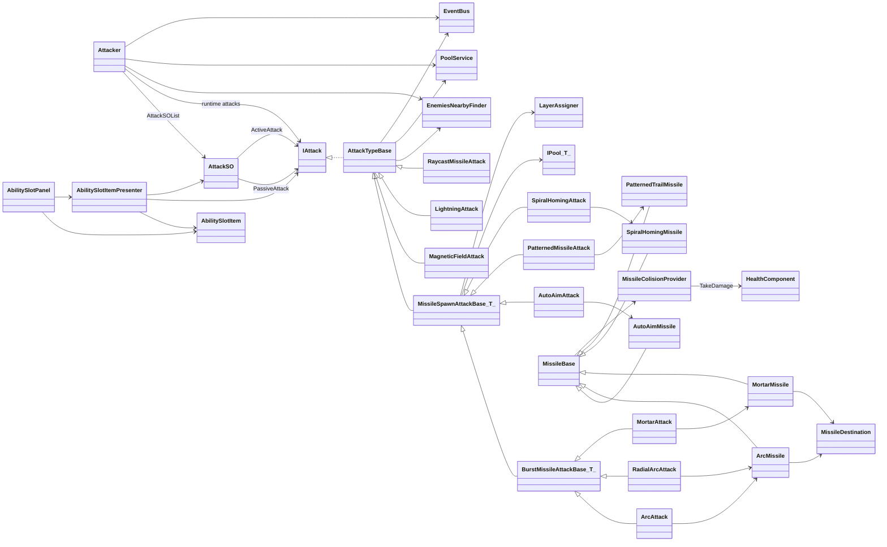

```mermaid
classDiagram
direction LR

class IAttack
class AttackSO
class Attacker
class EnemiesNearbyFinder
class LayerAssigner
class AttackTypeBase
class MissileSpawnAttackBase_T_
class BurstMissileAttackBase_T_
class AutoAimAttack
class ArcAttack
class MortarAttack
class RadialArcAttack
class SpiralHomingAttack
class PatternedMissileAttack
class MagneticFieldAttack
class LightningAttack
class RaycastMissileAttack
class MissileBase
class AutoAimMissile
class ArcMissile
class MortarMissile
class SpiralHomingMissile
class PatternedTrailMissile
class MissileColisionProvider
class MissileDestination
class AbilitySlotPanel
class AbilitySlotItem
class AbilitySlotItemPresenter
class PoolService
class EventBus
class HealthComponent
class IPool_T_

IAttack <|.. AttackTypeBase
AttackTypeBase <|-- MissileSpawnAttackBase_T_
MissileSpawnAttackBase_T_ <|-- BurstMissileAttackBase_T_

MissileSpawnAttackBase_T_ <|-- AutoAimAttack
MissileSpawnAttackBase_T_ <|-- PatternedMissileAttack
MissileSpawnAttackBase_T_ <|-- SpiralHomingAttack
BurstMissileAttackBase_T_ <|-- ArcAttack
BurstMissileAttackBase_T_ <|-- RadialArcAttack
BurstMissileAttackBase_T_ <|-- MortarAttack
AttackTypeBase <|-- MagneticFieldAttack
AttackTypeBase <|-- LightningAttack
AttackTypeBase <|-- RaycastMissileAttack

MissileBase <|-- AutoAimMissile
MissileBase <|-- ArcMissile
MissileBase <|-- MortarMissile
MissileBase <|-- SpiralHomingMissile
MissileBase <|-- PatternedTrailMissile

Attacker --> AttackSO : AttackSOList
Attacker --> IAttack : runtime attacks
Attacker --> EnemiesNearbyFinder
Attacker --> PoolService
Attacker --> EventBus

AttackSO --> IAttack : PassiveAttack
AttackSO --> IAttack : ActiveAttack

AttackTypeBase --> EnemiesNearbyFinder
AttackTypeBase --> PoolService
AttackTypeBase --> EventBus
MissileSpawnAttackBase_T_ --> IPool_T_
MissileSpawnAttackBase_T_ --> LayerAssigner

AutoAimAttack --> AutoAimMissile
ArcAttack --> ArcMissile
MortarAttack --> MortarMissile
RadialArcAttack --> ArcMissile
SpiralHomingAttack --> SpiralHomingMissile
PatternedMissileAttack --> PatternedTrailMissile

MissileBase --> MissileColisionProvider
ArcMissile --> MissileDestination
MortarMissile --> MissileDestination
MissileColisionProvider --> HealthComponent : TakeDamage

AbilitySlotPanel --> AbilitySlotItem
AbilitySlotPanel --> AbilitySlotItemPresenter
AbilitySlotItemPresenter --> AbilitySlotItem
AbilitySlotItemPresenter --> IAttack
AbilitySlotItemPresenter --> AttackSO
```